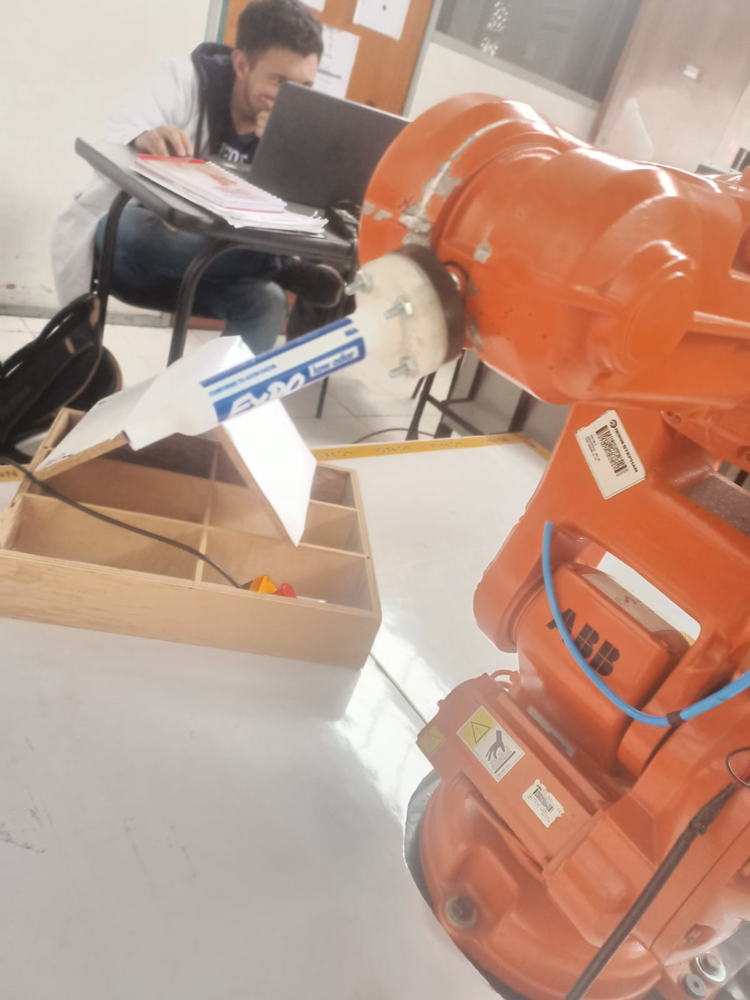
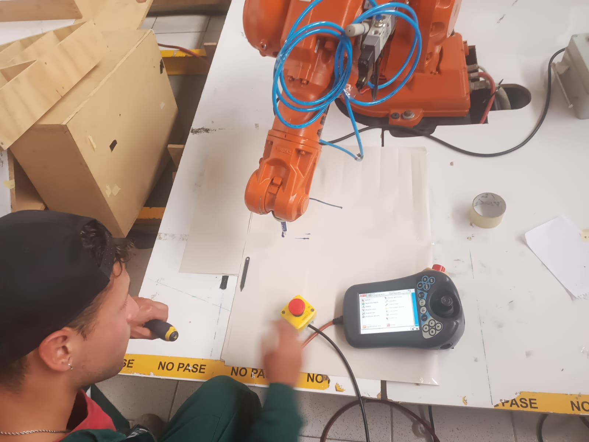

# ABB-IRB-140--Robot-Industrial
Presentado por Theylor Andres Amaya Villabon taamayav@unal.edu.co , Juan Pablo Ortiz Mendoza jportizme@unal.edu.co

En este repositorio, puedes acceder a todos los archivos esenciales que te serán útiles para llevar a cabo la primera práctica de la asignatura de Robótica en la Universidad Nacional de Colombia durante el semestre 2023-2. Esta práctica se enfoca en la creación de una herramienta adaptable para el Manipulador industrial ABB IRB 140. Su principal objetivo es permitir la ejecución de un proceso de escritura utilizando un marcador, siguiendo las trayectorias predefinidas en el programa en RAPID.

Además, es necesario que el robot escriba el nombre de los dos estudiantes encargados del proyecto como parte integral de la implementación práctica. Esto significa que la rutina de RAPID que se debe desarrollar surgirá como resultado de un proceso de simulación en Robot Studio. Durante este proceso, es crucial llevar a cabo una calibración precisa tanto de la herramienta como del Workobject. Esto garantizará la generación de una trayectoria segura y precisa que incluirá la escritura de los nombres de los estudiantes de manera precisa y legible.

# Diseño de la herramienta 

El objetivo fundamental es lograr que esta herramienta se ajuste de manera precisa y segura a la brida del eje 6 del Manipulador industrial ABB IRB 140. Esta adaptación permitirá que la herramienta funcione de manera estable y efectiva durante la ejecución de la tarea.

Una característica esencial de esta herramienta es su capacidad para mantener de manera constante un marcador en su extremo. El marcador, en este contexto, actuará como el efector final de la herramienta y será utilizado para escribir los nombres de los dos estudiantes encargados del proyecto.

En este proyecto, hemos aprovechado la ingeniosa funcionalidad de los marcadores, que se ajustan a su respectiva tapa en la parte posterior de los mismos. Esta característica nos ha servido como punto de partida para crear una solución ingeniosa. Aprovechando el archivo CAD de la brida del eje 6 del Manipulador industrial ABB IRB 140, hemos llevado a cabo un proceso de diseño y manufactura aditiva para desarrollar un acople específico. Una vez se tiene el modelo fisico se toman medidas y se crea un modelo CAD fiel a su morfologia.

# Diseño del Workobject
Se plantea la idea de llevar a cabo el trabajo en un tablero dispuesto horizontalmente, ubicado a una altura de 20 cm sobre la superficie del robot. Este enfoque permite establecer un entorno de trabajo óptimo para el Manipulador industrial ABB IRB 140. Además, se ha establecido que las dimensiones del objeto de trabajo serán de 308x270 mm.

Para comenzar, se ha creado un modelo que sigue estas dimensiones, lo cual sirve como punto de partida para posteriormente crear el objeto de trabajo en RobotStudio. 

# Robot Studio

**Creación de la herramienta** 

La creación de esta herramienta involucra un proceso esencial que comienza con la importación del modelo CAD. Esta importación es crucial ya que proporciona una representación del tamaño y estructura de la herramienta que estamos desarrollando. Sin embargo, más allá de la apariencia física, el aspecto más crítico y fundamental de esta herramienta es la posición y orientación de su Punto de Control de la Herramienta (TCP, por sus siglas en inglés).

La alineación precisa del TCP con respecto al modelo real de la herramienta es un componente vital de este proceso. El TCP es el punto en el extremo de la herramienta que el robot utiliza como referencia para ejecutar tareas específicas. Asegurar que la posición y la orientación del TCP coincidan perfectamente con las del modelo físico es de suma importancia, ya que esto garantiza que el robot funcione de manera precisa y efectiva en la tarea asignada.

**Creación Workobject**

La creación del Workobject es un paso fundamental en este proyecto, ya que establece la base para la ejecución precisa de las trayectorias en el robot. En este proceso, hemos tomado como referencia el modelo del tablero que será utilizado en la tarea. Para lograr esto, hemos empleado un enfoque que se basa en la definición de tres puntos clave en el tablero. Estos puntos se utilizan para crear un sistema de referencia específico para el tablero.

Este sistema de referencia es esencial, ya que servirá como el marco de trabajo en el que se ejecutarán las trayectorias del robot. Cada punto en las trayectorias estará referenciado a este sistema, lo que garantiza que el robot se desplace de manera precisa y coherente en relación con el tablero.

# Parametros de la trayectoria
[Codigo rapid](RAPID_CODE/Module1.mod)

# Simulación

La simulación desempeña un papel esencial en este proyecto, ya que nos permite observar y evaluar el comportamiento del robot en un entorno controlado antes de su implementación física. En esta fase de simulación, podemos destacar varios aspectos fundamentales que proporcionan una visión clara y detallada del proceso.

En primer lugar, es evidente que el robot sigue de manera precisa las trayectorias contenidas en el código RAPID. Esto es un logro significativo, ya que asegura que las letras y la decoración se coloquen exactamente donde se pretende en el objeto de trabajo, garantizando la legibilidad y la estética de la escritura.

Además, durante la simulación, se pueden observar las variaciones de velocidad que el robot experimenta a lo largo de la tarea. Esta información es esencial para ajustar y optimizar la velocidad de operación del robot, lo que puede ser importante para garantizar una escritura uniforme y de alta calidad.

La zona tolerable de error es otro aspecto destacado de la simulación. Este factor determina el margen de error aceptable en la ejecución de las trayectorias. Identificar y definir esta zona es crucial para garantizar que el robot pueda adaptarse a pequeñas desviaciones sin comprometer la calidad de la escritura.

Por último, la secuencia de rutinas definida es esencial en la simulación. El orden en el que se ejecutan las acciones, desde el retorno a la posición de inicio ("Home") hasta la escritura de las letras y la decoración, y luego nuevamente al retorno a la posición inicial, se ha planificado cuidadosamente para lograr una ejecución coherente y efectiva de la tarea en el siguiente orden:

Home

letras T-h-e-y

decoración (":v")

letras J-u-a-n

Home

# video
[Video Simulación](VIDEO_SIMULACIÓN)

# Implementación
Durante esta seccion de trabajo se realizan varios pasos basicos para obtener un trabajo funcional con el robot fisico.

Inicialmente se realiza el montaje de la herramienta como se ve en las imagenes anteriores.

Se agragan los archivos exportados del entorno RAPID de RobotStudio para trabajar con los robots ABB 140 ubicados en el LabSIR. Se cargan desde el mando del robot HMI.

Luego se coloca un objeto, que en el caso de esta practica, es una punta fina, con la cual para rectificar los valores asignados en el modelo cad de la herramienta, se asignan al robot, para que asi con este se pueda realizar una calibración que el software interno del roboto realiza, para esto se llega al mismo punto en cuatro orientaciones diferentes , asi el roboto calibra el frame que debe ir en la punta de la herramient, y asi realizar los movimientos correctos internamente con este frame en la punta de la herramienta.

Luego de esto, e procede a calibrar el workobject, esto se raliza con el metódo de los 3 puntos, primariamente se coloca el punto origen del workobject, luego un punto en el eje X positivo, y por ultimo un punto en el eje Y positivo, con lo cual el sistema crea un sistema de ejes coordenados (X,Y,Z) para el workobject.

Como metódo de verificación, se trabaja desde el HMI moviendose a varios puntos claves contrastando con la ubicacion en la simulación virtual, para asi saber que el work object quedo definido correctamente. Despues de esto es posible realizar la trayectoria diseñada para el robot. Asi se logra realizar la trayectoria deseada y planificada.

Para el caso realizado, quedo realizado incorrectamente le codigo, apesar de haber realizado un debug, ya que el robot mostro que era imposible llegar a las posicionea planteadas en simulación, se intento realizar la trayectoria manualmente, fracasando ya que se estrello la herramienta , a continuacion se muestran los resultados de lo realizado en fisico.

En las dos imagenes previas se observa el montaje de la herramienta tanto en simulación como en el robot fisico.

Luego en la consiguiente imagen se había realizado ya la calibracion de herramienta, y se estaba realizadon la calibracion del workobject

En esta imagen se observa el HMI y como se estaban ubicando los dos ejes, X,Y respectivamente en el workobject que en este caso es paper periodico.

Latimosamente luego de piscionado el workobject, no fue permitido realizar la trayectoria presentada anteriormente. Para realizar esta verificación se posicionó el robot en todos sus ejes en  0° lo cual es el estado home 0 del robot y se intento realizar de nuevo esta ntrayectoria arrojando el mismo error anterior, de posiciones no alcnazables por el robot, por cuestiones de espacio no se pudo disponer nuevamente del robot, por lo cual se intentó en el mismo momento realizar el dibujo manual de un rectangulo, lo cual llevo a la fractura de la impresion de portaherramienta. Asi se vieron lo errores que pueden dar lugar a fallas graves como estrellar la máquina durante su trabajo.

Este accidente que apesar de haberse realizado a una baja velocidad, ya una rutina planteada puede ser catastrofico. Se dio por l impresicion en el segundo paso mencionado para esta sección, el cual es colocar el marco de eferencia en la punta de la herramieta dando paso a un ligero movimiento inclinado que bastó para fracturar el PLA en el cual fue impreso el portaherramienta. Por este motivo no se pudo continuar con el procedimiento fisico.

# Conclusiones y aspectos a mejorar

Del trabajo realizado se tiene una principal caracteristica, y es que el trabajo con el robot fisico es bastante diferente al trabajo en el softtware RobotStudio. Por este motivo se dieron fallas al momento de la implementación fisica ya que por cuestión de disposicion del robot,  y la fractura del portaherramienta, no se logro culminar exitosamente el problema, de esta leccion aprendida, se tiene que es pertinente realizar una trayectoria en el aire, para evitar un error de trayectoria y asi estrellar el equipo. Por otro lado se logró comprender como realiza el robot internamente los ajustes de coordenadas, ya que para ubicar el workobject, se movio por medio de la rotación de cada articulación, y tambien se procedió a moverse a traves de un sistema coordenado cartesiano, y el robot internamente realizaba los ajustes para realizar el movimiento. Es vital denotar que siempre es necesario tener correctamente la calibracion del sistema coordenado del workobject y de la herramienta.

Se aconseja ademas verificar internamente el codigo ya en el HMI debido a que a pesar del software RobotStudio no arrojar errores de programación, el sistema fisico puede quee encuentre bugs en el codigo generado por RAPID, y asi realizar una correcta practica.

